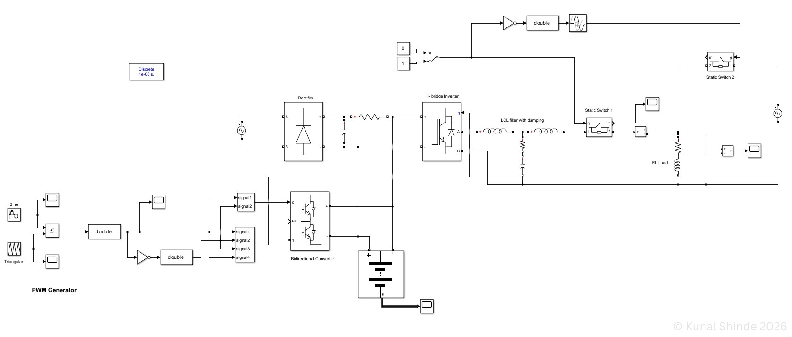
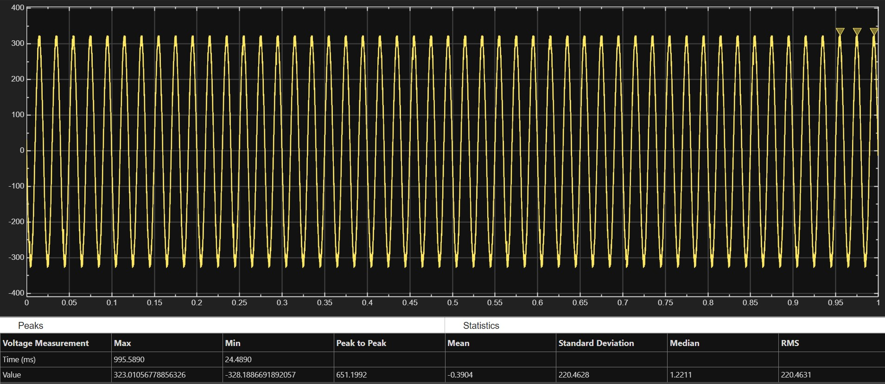
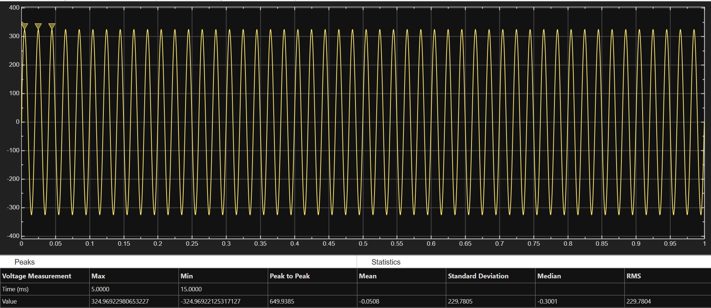
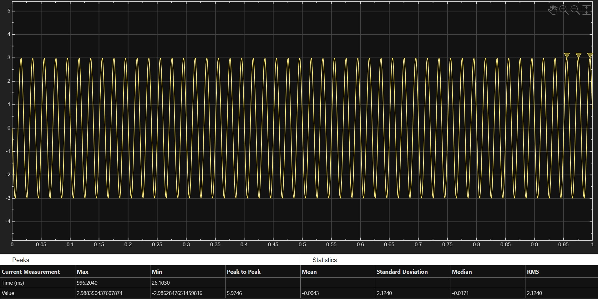

# Online UPS Simulation (Double Conversion)

MATLAB Simulink model of a double-conversion Online UPS implementing AC–DC–AC power conversion with SPWM-based inverter control and battery-backed DC link for uninterrupted power supply.

---

## Overview

This project presents the simulation of an Online Uninterruptible Power Supply (UPS) system designed to provide continuous and stable AC power to critical loads by isolating them from input disturbances.

---

## System Components

* AC Source
* Rectifier
* DC Link Capacitor
* Battery Energy Storage
* PWM-based Inverter
* Static Switches (Bypass Control)
* Load (RL)

---

## Working Principle

The input AC supply is converted into DC using a rectifier. The DC link maintains a stable voltage and supports battery charging. A PWM-controlled inverter continuously supplies AC power to the load. During input disturbances or failure, the battery and bypass path ensure uninterrupted operation.

---

## Simulation Model

---

## Output Waveforms

### Inverter Output Voltage (Normal Operation)

### Bypass Voltage (Backup Mode)

### Load Current

---

## Implementation Details

* SPWM-based inverter used for generating switching pulses
* MUX used to combine multiple PWM signals into a vectorized input for H-bridge inverter gate control
* LCL filter with damping resistor for output smoothing
* Manual switches used for ON/OFF and bypass control
* Dual AC source configuration for main and bypass supply to ensure electrical isolation and prevent coupling effects
* Bidirectional buck-boost converter for battery charging and discharging

---

## Highlights

* Double-conversion UPS topology (AC–DC–AC)
* Continuous power supply without switching delay
* PWM-based inverter control
* Integrated battery backup system
* Bypass operation capability

---

## Author

Developed by: Kunal Shinde
